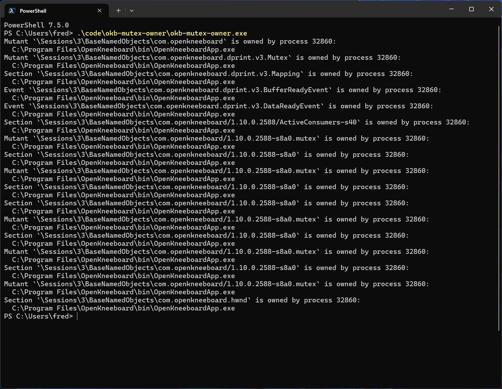

# OKB-Mutex-Owner

This is a command line tool for debugging "OpenKneeboard is already running" errors. It will list which processes currently are using OpenKneeboard resources.

## LICENSE

This project is licensed under the LGPL, version 2.1.

This project contains Windows NT structure definitions copied from [the Wine project](https://www.winehq.org/).